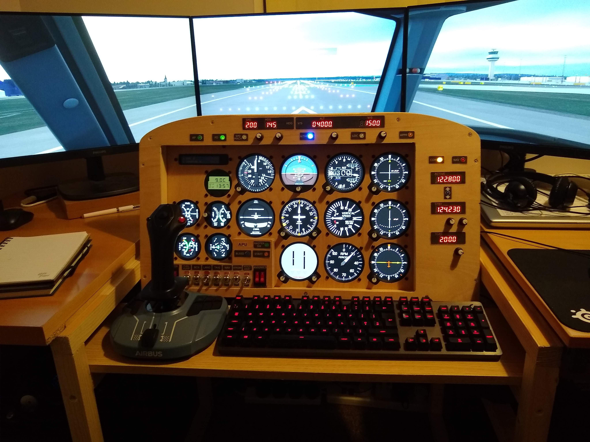

# MICROSOFT FLIGHT SIMULATOR 2020 - AUTOPILOT PANEL

# Quick Start

Download the following two files.

Link: [Latest release of Autopilot Panel for Raspberry Pi Zero W](https://github.com/scott-vincent/autopilot-panel/releases/latest/download/autopilot-panel-v1.3.1-raspi.tar.gz)

Link: [Latest release of Instrument Data Link for Windows](https://github.com/scott-vincent/instrument-data-link/releases/latest/download/instrument-data-link-v1.7.1-windows-x64.zip)

Unzip instrument-data-link into its own folder and double-click instrument-data-link.exe to run it.

Untar autopilot-panel on your Raspberry Pi. Edit settings/autopilot-panel.json and in the "Data Link" section change the IP address of the "Host" to the address where FS2020 is running on your local network, e.g. 192.168.0.1 - You can find the correct address of your host by running a command prompt on the host machine and running ipconfig, then scroll back and look for the first "IPv4 Address" line. Now enter ./run.sh to run the program.

# Introduction

An autopilot panel for MS FlightSim 2020. This program is designed to run
on a Raspberry Pi Zero W and requires the following hardware:

8 digit 7-segment display x 3 : https://www.amazon.co.uk/gp/product/B087BSH26N  

Push button with LED x 6 : https://www.amazon.co.uk/gp/product/B07KPSZ731 

Rotary encoder x 4 : https://www.amazon.co.uk/gp/product/B07FYHG2QZ  

It requires the companion program from here

  https://github.com/scott-vincent/instrument-data-link

The companion program runs on the same host as MS FS2020 and passes data between
the panel and the flight simulator over your Wifi connection.

# Donate

If you find this project useful, would like to see it developed further or would just like to buy the author a beer, please consider a small donation.

# Additional Photos

Panel Front

Panel Back

Panel Pi Zeroes

